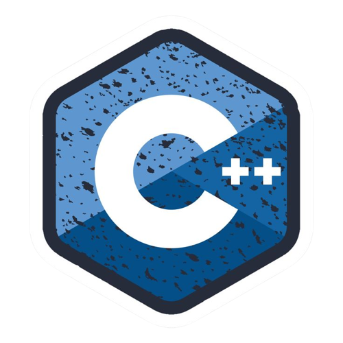
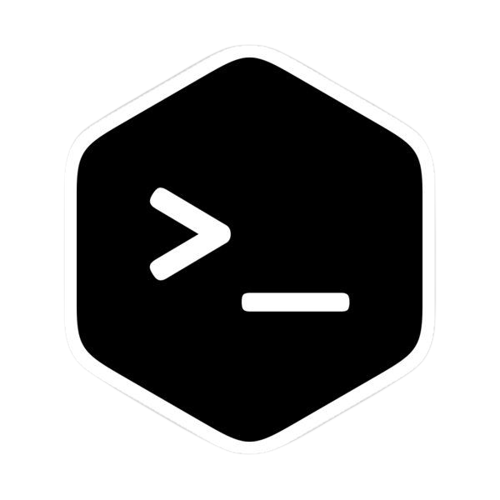

# Hello my friend 
### ☕ I am **Adam**! Welcome to my GitHub profile
##### I am a 16-year-old teenager from Iran and I love my country. I am always interested in learning and improving my skills. Currently, I am learning C++ programming language and becoming familiar with Linux in more detail.I am passionate about technology and the world of technology, and always strive to improve my skills in this area. My goal is to make progress and participate in various projects, and to achieve that, I am focused on advancing myself with enthusiasm and motivation for learning. 
***
## Learnings & My Mail
 

## Statistics
 
  

***

